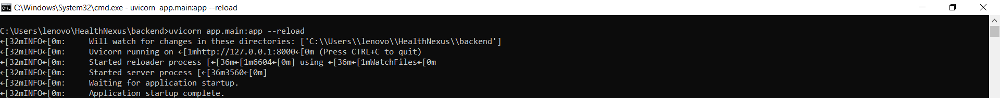
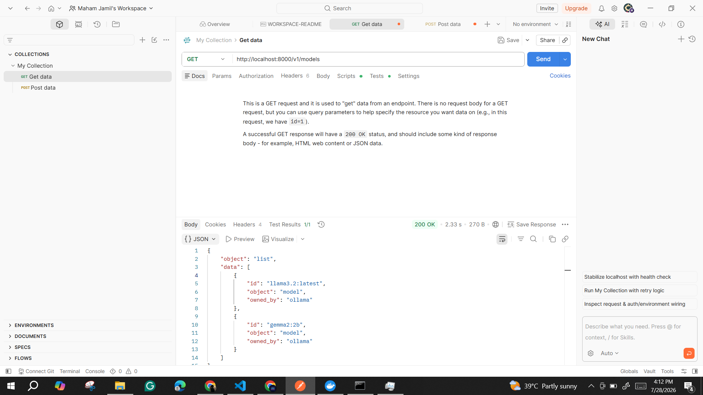
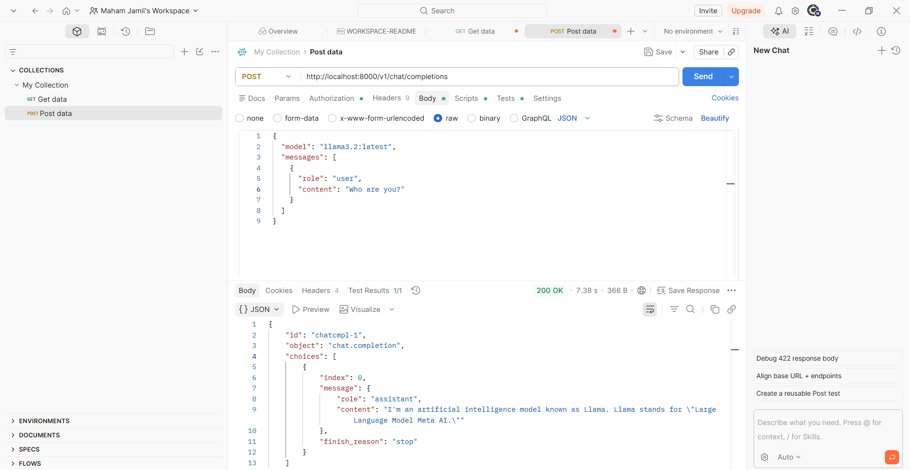
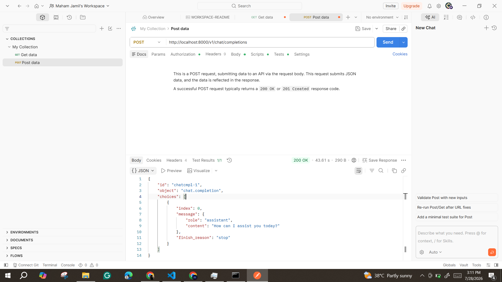
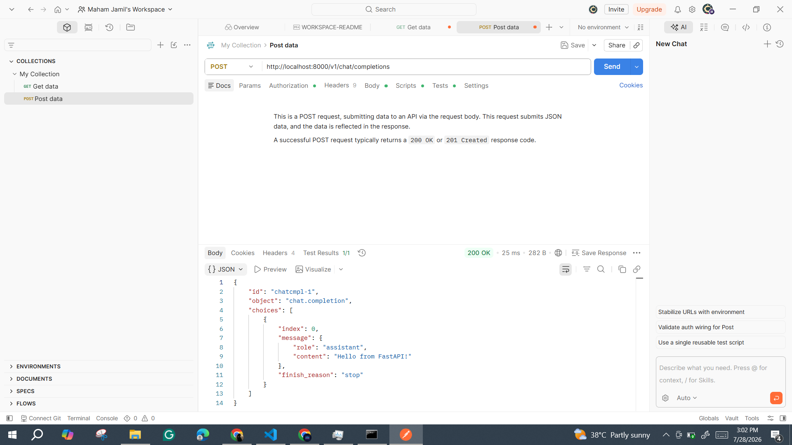
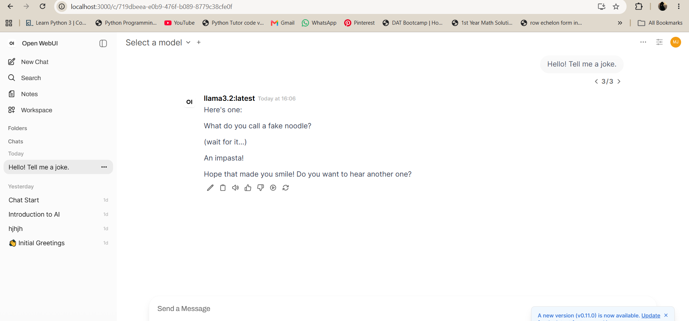
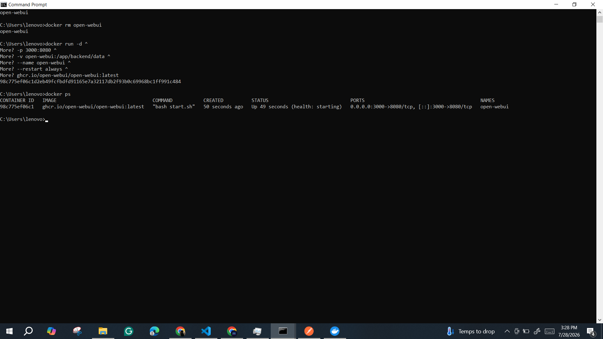

# FastAPI Custom Backend API Documentation

## 1. Overview

A custom backend API was developed using **FastAPI** to act as an intermediate layer between OpenWebUI and Ollama. The backend exposes **OpenAI-compatible API endpoints**, allowing OpenWebUI to communicate with a local language model without connecting directly to Ollama.

The implementation consisted of two stages:

1. Connecting **FastAPI** with **Ollama** by implementing OpenAI-compatible endpoints.
2. Configuring **OpenWebUI** to use the custom FastAPI backend and verifying end-to-end communication.

---

## 2. Technology Stack

| Technology | Purpose |
|------------|---------|
| FastAPI | Backend API development |
| Python | Programming language |
| Pydantic | Request validation and schema management |
| Uvicorn | Running the FastAPI server |
| Ollama | Local LLM inference |
| OpenWebUI | Chat interface |
| Docker | Running OpenWebUI |
| Postman | API testing |
| Git/GitHub | Version control |

---

## 3. FastAPI Application Setup

The FastAPI application was configured and executed using Uvicorn.

Command used:

```bash
uvicorn app.main:app --reload
```

The server started successfully and was accessible for API testing.




---

## 4. Connecting FastAPI with Ollama

The FastAPI backend was connected to Ollama to forward chat requests to the local language model.

Two OpenAI-compatible endpoints were implemented:

```
GET /v1/models
POST /v1/chat/completions
```

These endpoints allow clients to retrieve available models and generate chat responses using Ollama.

---

## 5. API Testing Using Postman

The implemented endpoints were tested using **Postman** before integrating OpenWebUI.

### 5.1 Model Endpoint Verification

The `GET /v1/models` endpoint was tested to verify that the FastAPI backend could successfully retrieve the available Ollama models.




---

### 5.2 Chat Completion Endpoint Verification

The `POST /v1/chat/completions` endpoint was tested by sending:

- Model name
- User message

The backend successfully processed the request through Ollama and returned an OpenAI-compatible response.




---

### 5.3 Model Response Verification

Additional testing confirmed that the selected model was responding correctly through the FastAPI backend.




---

## 6. Request Processing Flow

The request flow through the custom backend is shown below.

```
Client Request
      │
      ▼
FastAPI Endpoint
      │
      ▼
Request Validation
      │
      ▼
Ollama
      │
      ▼
OpenAI-Compatible Response
```

---

## 7. OpenAI-Compatible Response Format

Responses were returned using the OpenAI Chat Completion API format.

Example response:

```json
{
  "id": "chatcmpl-1",
  "object": "chat.completion",
  "choices": [
    {
      "message": {
        "role": "assistant",
        "content": "response text"
      }
    }
  ]
}
```

This format enables compatibility with clients such as OpenWebUI.

---

## 8. Request Validation

Pydantic models were used to validate incoming requests.

Validation includes:

- Required fields
- Request structure validation
- Automatic error handling

Example validation error:

```json
{
  "detail": [
    {
      "type": "missing",
      "loc": [
        "body",
        "username"
      ],
      "msg": "Field required"
    }
  ]
}
```

---

## 9. OpenWebUI Integration

After verifying the FastAPI endpoints, OpenWebUI was configured to use the custom FastAPI backend instead of connecting directly to Ollama.

The integration was verified by sending chat messages through OpenWebUI and receiving responses generated through the FastAPI backend.

### FastAPI Connection



### Chat Verification



---

## 10. Docker Verification

The OpenWebUI Docker container was verified to be running successfully during integration.




---

## 11. Git Version Control

The completed implementation was tracked using Git and pushed to the project repository.

Changes included:

- FastAPI backend setup
- OpenAI-compatible endpoint implementation
- Ollama integration
- Postman API testing
- OpenWebUI integration
- Documentation updates

---

# Summary

Completed work:

- ✅ Set up the FastAPI backend
- ✅ Connected FastAPI with Ollama
- ✅ Implemented the `GET /v1/models` endpoint
- ✅ Implemented the `POST /v1/chat/completions` endpoint
- ✅ Tested both endpoints using Postman
- ✅ Verified available Ollama models
- ✅ Configured OpenWebUI to use the FastAPI backend
- ✅ Verified end-to-end chat through OpenWebUI
- ✅ Verified Docker container execution
- ✅ Managed changes using Git/GitHub