# HealthNexus — Migration from Manual Sequential Steps to LangChain Agent

## Overview

The chat pipeline was rebuilt from a manual, hardcoded sequence of Groq API
calls (forced tool order: RAG lookup → Cypher generation → Neo4j execution →
final answer) into a real LangChain `AgentExecutor` that decides on its own
which tools to call, in what order, and how many times.

## What the System Does

Given a biomedical question, the agent:
1. Decides on its own whether to query the Neo4j PrimeKG knowledge graph,
   look up similar past questions via FAISS (to help write a better Cypher
   query), both, or neither — no hardcoded tool order.
2. If Neo4j has relevant data, answers from it and cites the graph.
3. If Neo4j doesn't have the answer, falls back to general biomedical
   knowledge and clearly labels it as such — never presenting general
   knowledge as if it came from the graph.
4. If an answer mixes both sources, each part is labeled separately.
5. Remembers the full conversation, so follow-up questions ("which of those
   are hereditary?", "summarize our conversation") resolve correctly using
   prior context.
6. Shows its reasoning in a collapsible "Thought" section in OpenWebUI —
   which tools it called and what came back — before the final answer.

**Stack:** FastAPI, LangChain (`create_tool_calling_agent` + `AgentExecutor`),
Groq (`openai/gpt-oss-120b`), Neo4j (PrimeKG), FAISS + sentence-transformers
(RAG over a manual Cypher example bank), OpenWebUI as the frontend.

---

## Issues Found & Fixed

### 1. 413 Token Limit Error

**Issue:** A Neo4j query returning 900+ mutation/protein names (with
duplicates) was passed whole into the LLM prompt, exceeding Groq's per-minute
token limit and failing the request outright.

**Fix:** Added truncation to `execute_neo4j_query` — results are capped
(e.g. 100 rows) and a `note` field tells the model how many rows exist in
total, so it can say "showing X of Y" instead of implying completeness.

```markdown
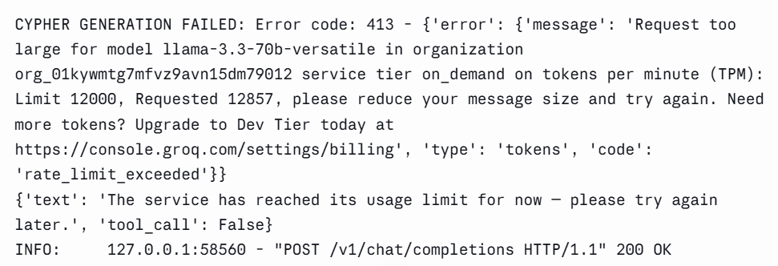
```

---

### 2. Wrong Cypher Query for "Mutations"

**Issue:** Asking about TP53 mutations returned a list of *interacting
proteins* (via a `protein_protein` relationship) instead of actual mutation
data — the FAISS example bank had mapped "mutation" to the wrong relationship
type, and the graph doesn't store mutation-level data at all.

**Fix:** Documented the schema gap; added a FAISS example teaching the model
that mutation-level queries aren't answerable from this graph and shouldn't be
faked with protein-interaction data.

---

### 3. Manual Sequential Tool-Forcing

**Issue:** `chat_service.py` manually forced tool order
(`tool_choice={"type": "function", ...}`) for RAG → Neo4j → final answer,
duplicating logic that LangChain's own agent loop already handles, and
conflicting with a parallel `ask_agent()` call that was silently failing and
falling through to the old code.

**Fix:** Removed the entire manual turn1/turn2/turn3 flow and
`should_use_neo4j_tool()`. Routed everything through `ask_agent()`
(`AgentExecutor`), letting the LLM choose its own tools autonomously.

```markdown

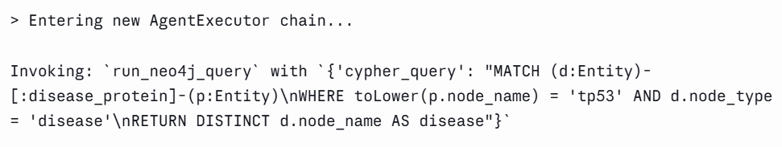
```

---


### 5. Duplicate Tool-Description Build (Startup Delay)

**Issue:** `build_tool_description()` (which queries Neo4j for schema:
properties, node types, relationship types) was called twice at import time —
once in `neo4j_tool.py`, again in `langchain_tools.py` — doubling a ~20–50s
startup cost.

**Fix:** `langchain_tools.py` now imports the already-built `description`
instead of rebuilding it.

```markdown
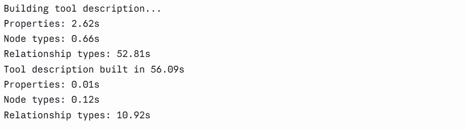
```

---

### 6. OpenWebUI Metadata Requests Breaking the Agent

**Issue:** OpenWebUI's internal housekeeping calls (title generation,
follow-up suggestions, tag generation — all prefixed `### Task:`) were routed
through the tool-bound agent, which sometimes tried to call a nonexistent
`json` tool and failed validation.

**Fix:** Added `is_metadata_request()` to detect these calls and route them
straight to the plain LLM (no tools bound), bypassing the agent entirely.

```markdown
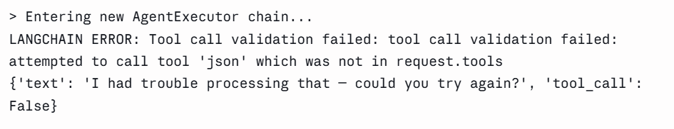
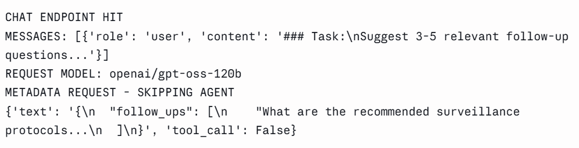
```

---

### 7. RAG Model Cold-Start Mid-Conversation

**Issue:** The FAISS/sentence-transformer model loaded lazily on the first
real chat request (~12s delay), landing on whichever user happened to ask
first.

**Fix:** Added a FastAPI startup event to call `get_rag_tool()` at boot,
moving the cost to server startup instead of a live request.

---

### 8. Broken Multi-Turn Memory

**Issue:** Follow-up questions like "which of those are hereditary?" failed
because `ask_agent()` only ever received the latest message — no
conversation history was passed to the LLM.

**Root cause (subtle):** Two separate `ChatPromptTemplate` definitions
existed in `langchain_agent.py`; the `agent`/`AgentExecutor` were built from
the *first* one (no `chat_history` placeholder) before the second,
history-aware prompt was even created — so passed-in history was silently
discarded.

**Fix:** Removed the duplicate prompt block; built the agent from the single
correct `ChatPromptTemplate` that includes `{chat_history}`.

```markdown
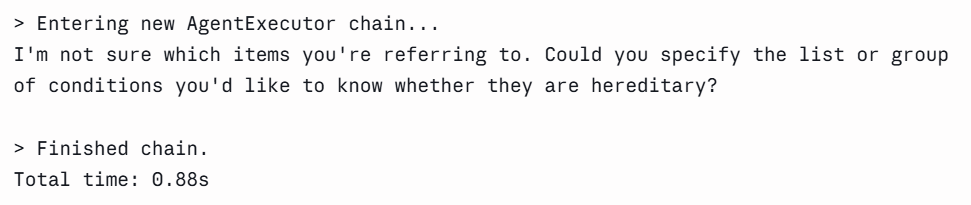
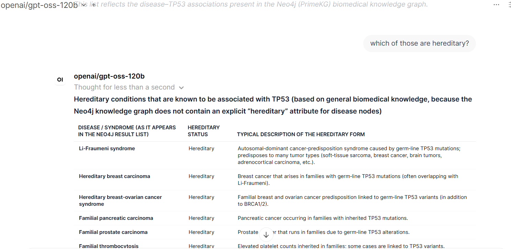
```

---

### 9. Fabricated Biomedical Claims

**Issue:** When asked "which of those are hereditary," the model invented a
confident inheritance mechanism ("Autosomal-dominant TP53 germ-line
mutation") for *every* row returned — including diseases with no real genetic
link to TP53 (e.g. Down syndrome, SAPHO syndrome) — and, in a later test,
invented entirely fictional disease categories like "hereditary sarcoma of
the aorta."

**Fix:** Tightened `SYSTEM_PROMPT`'s `<medical>` rules to forbid stating any
mechanism/attribute not explicitly present in tool output, forbid inventing
disease/syndrome names, and require explicit uncertainty when a hereditary
form isn't well-established.

```markdown
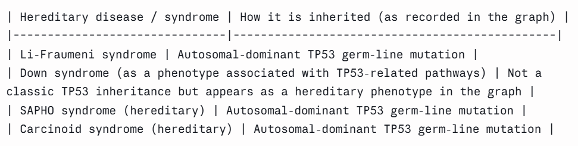
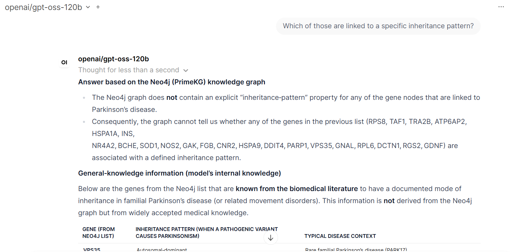
```

---

### 10. Mixed Sources Not Labeled Separately

**Issue:** Answers blending Neo4j data and general knowledge (e.g. a disease
list from the graph + a hereditary classification from training knowledge)
didn't clearly separate which claim came from which source.

**Fix:** Added a `<mixed_sources>` rule to `SYSTEM_PROMPT` requiring each part
of a mixed answer to be labeled separately, with a final citations section
naming both sources.

```markdown
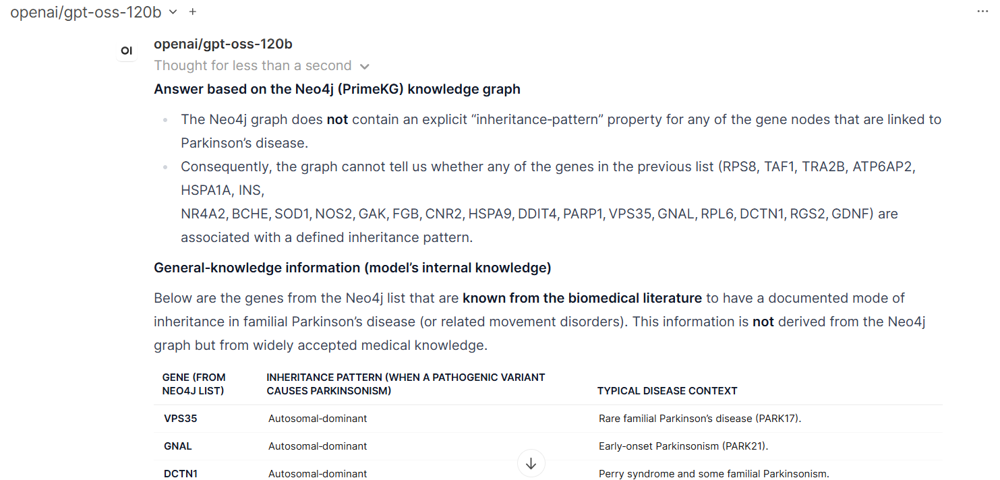
```

---

### 11. Missing-Information Fallback Refusal

**Issue:** For questions the graph couldn't answer at all (e.g. "how is
aspirin's mechanism of action"), the model sometimes stopped at "the graph
does not contain this" without actually answering from general knowledge.

**Fix:** Updated `<missing_information>` to require answering from general
knowledge (clearly labeled) instead of stopping short.

---

### 12. Chain-of-Thought Not Visible in OpenWebUI

**Issue:** No visibility into what the agent was doing (which tools, how many
calls) — reasoning only appeared in the terminal via `verbose=True`.

**Fix:** Enabled `return_intermediate_steps=True`; built a `<think>...</think>`
block summarizing tool calls and results, which OpenWebUI natively renders as
a collapsible "Thought for X seconds" section. Required switching the API
endpoint to support streaming (`StreamingResponse`) since non-streaming
responses don't get parsed for `<think>` tags.

---

### 13. Chain-of-Thought Content Too Technical

**Issue:** Initial `<think>` content dumped raw Cypher queries and Python
dict output — readable as a log, not as reasoning.

**Fix:** Replaced with plain-language, templated descriptions per tool call
(e.g. "📊 Searched the medical knowledge graph — returned 10 results"),
built from real data (tool name, result count) rather than model-generated
prose, to avoid introducing new fabrication risk into the thinking display.

```markdown

```

---

### 14. No-Tool-Call Turns Had No Thought Block

**Issue:** When the agent answered purely from conversation history/general
knowledge with zero tool calls, no `<think>` block was emitted at all.

**Fix:** Added a minimal fallback `<think>` block for zero-tool-call turns.

---

### 15. Corrupted FAISS Example Bank Rows

**Issue:** Newly added example rows in the Excel knowledge bank had corrupted
`Neo4J Response` cells (broken JSON, embedded row numbers, typo'd property
names like `g.node-name`) from copy-pasting rendered tables instead of raw
JSON.

**Fix:** Replaced with valid, clean JSON matching the actual query output
format.

---

### 16. Fragile Keyword-Based Filtering

**Issue:** Cypher queries filtering by substrings like `CONTAINS 'syndrome'`
or `CONTAINS 'familial'` were treated as reliable classification (e.g. "is
this hereditary") when they're just weak text matches.

**Fix:** Added a rule to the Neo4j tool description flagging keyword-based
name filters as heuristics, requiring the model to state this limitation
when presenting such results.

---

### 17. Chat Summarization via Conversation Memory

**Capability:** Since multi-turn `chat_history` was fixed (issue #8), the
agent can summarize the full conversation on request without any new tool —
it already has access to prior turns via the same `{chat_history}` prompt
placeholder used for follow-up questions.

**Test:** After a multi-turn conversation, asking "summarize our
conversation" or "summarize this chat" produces an accurate summary of all
prior turns, confirming chat memory works beyond single-hop follow-ups.

​```markdown
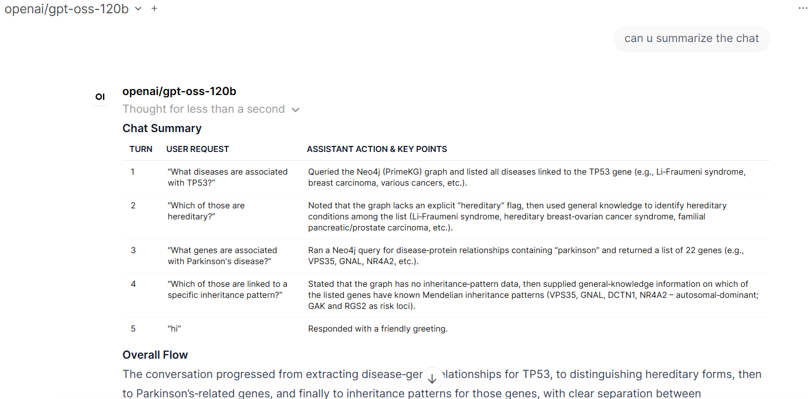
​```

## Cleanup

- Removed dead code: `neo4j_tool_groq` and `rag_tool_groq` (unused
  OpenAI-function-calling-style dicts left over from the manual-call era)
- Removed exposed API key print statement; rotated key
- Added `max_iterations=6` cap to `AgentExecutor` to prevent runaway tool-call
  loops

## Deliberately Not Done

- **Clickable citation modal** (like Gemini/ChatGPT's source-favicon UI) —
  not achievable through an external OpenAI-compatible API; OpenWebUI's
  native citation UI requires running as an in-app Function/Pipe using
  `__event_emitter__`, which this architecture doesn't use.
- **Real web-search tool** for general-knowledge citations — considered, not
  implemented per project decision.