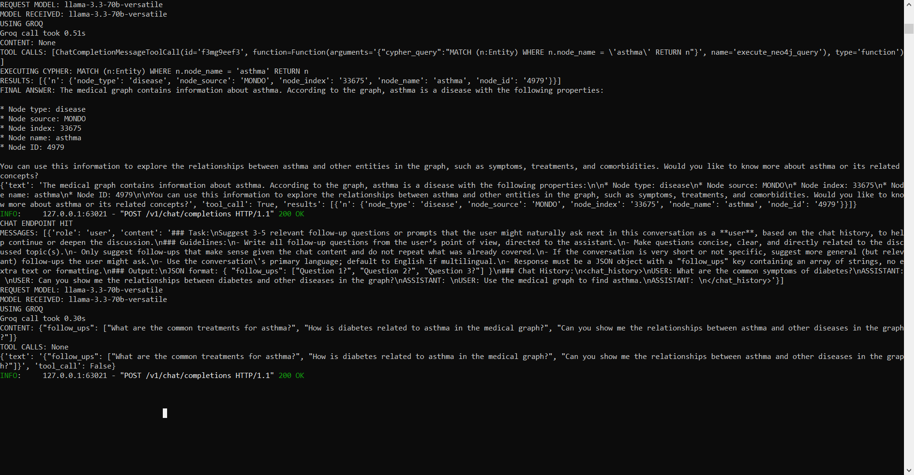

---

# Neo4j Tool Integration

Initially, the Neo4j tool integration was implemented using the Gemini API. During testing, Gemini encountered function-calling compatibility issues with the current SDK (invalid function role) and free-tier quota limits, which prevented reliable end-to-end testing. To ensure stable tool execution and validation, the implementation was switched to the Groq-hosted Llama 3.3 model. The Groq integration successfully supports function calling, Neo4j query execution, and generation of a final response based on the retrieved graph data.

## Objective

Integrated the Neo4j medical knowledge graph as a tool that can be invoked by the LLM through function calling.

## Implementation

* Added a Neo4j tool definition describing the PrimeKG schema.
* Configured the Groq Llama model to use the Neo4j tool.
* Executed Cypher queries generated by the LLM.
* Returned Neo4j query results back to the LLM to generate a final natural-language response.
* Verified successful tool execution through OpenWebUI.

---

## Verification

Test query:

```text
Find asthma in the medical graph.
```

Result:

* LLM invoked the Neo4j tool.
* Cypher query executed successfully.
* Retrieved the asthma node from PrimeKG.
* Returned a summarized response to the user.




---
