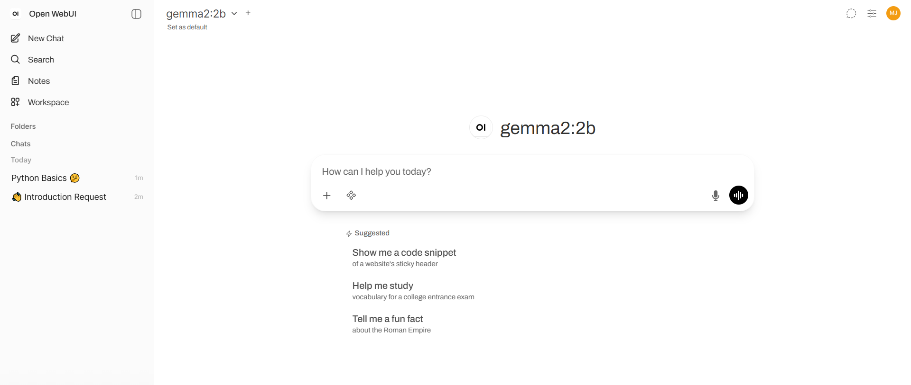
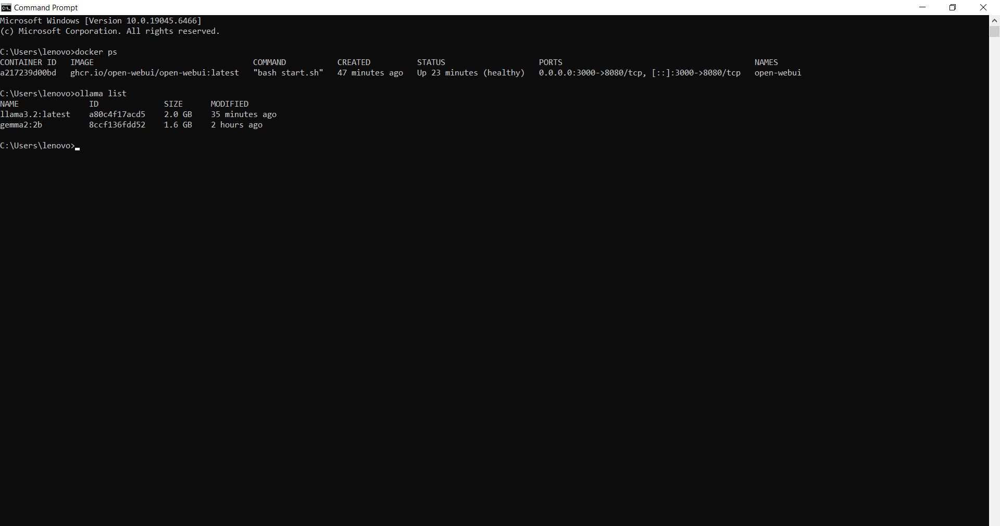
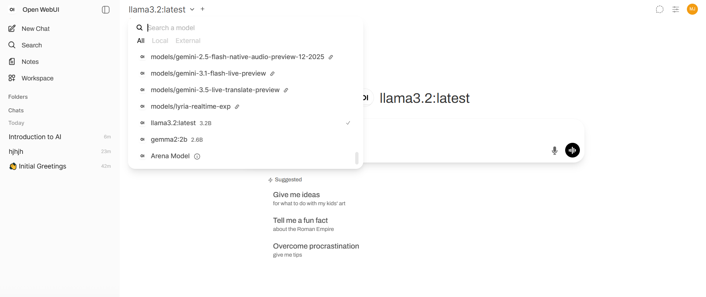
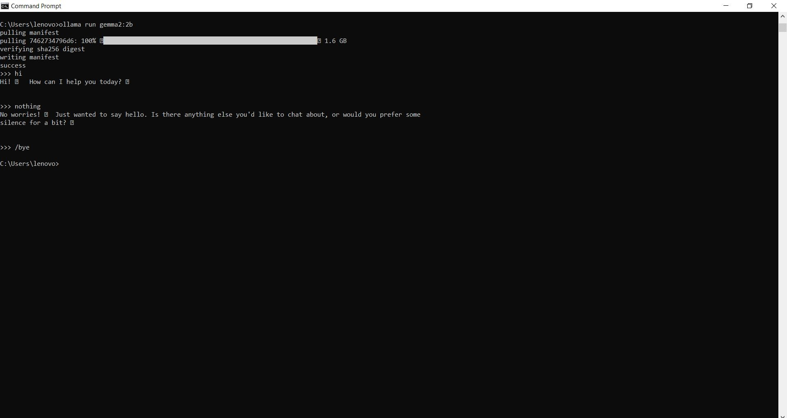
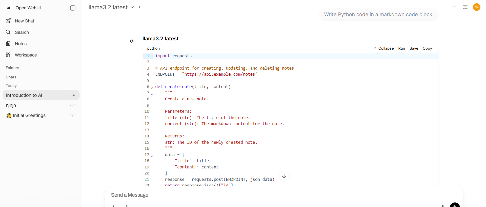

# OpenWebUI Local Setup Guide

## Overview

This document describes the local deployment and configuration of **OpenWebUI** using **Docker** with **Ollama** as the LLM provider.

The purpose of this setup is to provide a working chat interface for local AI development. Backend integration with LangChain/LangGraph is out of scope for this implementation and will be added in future work.

---

# Architecture

```
Browser
    │
    ▼
OpenWebUI (Docker)
    │
    ▼
Ollama (Local Host)
    │
    ▼
llama3.2
```

OpenWebUI runs inside a Docker container and communicates directly with the locally running Ollama server.

---

# Prerequisites

Before starting, ensure the following are installed:

* Docker Desktop
* Ollama

Verify the installations:

```bash
docker --version
```

```bash
ollama --version
```

---

# Install Ollama

Download and install Ollama from:

[https://ollama.com/download](https://ollama.com/download)

After installation, verify that Ollama is running:

```bash
ollama list
```

---

# Download a Local Model

Pull a supported model:

```bash
ollama pull llama3.2
```

Verify the downloaded models:

```bash
ollama list
```

Example output:

```
NAME
llama3.2:latest
gemma2:2b
```

---

# Deploy OpenWebUI

Run the following Docker command:

```bash
docker run -d \
-p 3000:8080 \
--add-host=host.docker.internal:host-gateway \
-e OLLAMA_BASE_URL=http://host.docker.internal:11434 \
-v open-webui:/app/backend/data \
--name open-webui \
--restart always \
ghcr.io/open-webui/open-webui:latest
```

### Command Explanation

| Option                                                 | Description                                                                 |
| ------------------------------------------------------ | --------------------------------------------------------------------------- |
| `docker run`                                           | Creates and starts a new container.                                         |
| `-d`                                                   | Runs the container in detached mode (background).                           |
| `-p 3000:8080`                                         | Maps port 3000 on the host to port 8080 inside the container.               |
| `--add-host=host.docker.internal:host-gateway`         | Allows the Docker container to access services running on the host machine. |
| `-e OLLAMA_BASE_URL=http://host.docker.internal:11434` | Specifies the address of the Ollama server.                                 |
| `-v open-webui:/app/backend/data`                      | Creates a persistent Docker volume for storing users, chats, and settings.  |
| `--name open-webui`                                    | Assigns the container name.                                                 |
| `--restart always`                                     | Automatically restarts the container after system or Docker restarts.       |
| `ghcr.io/open-webui/open-webui:latest`                 | Docker image used for deployment.                                           |

---

# Access OpenWebUI

Open the application in a browser:

```
http://localhost:3000
```

Create an account and log in.

## Login Page

---

# Environment Variables

| Variable          | Description                                       |
| ----------------- | ------------------------------------------------- |
| `OLLAMA_BASE_URL` | URL of the local Ollama server used by OpenWebUI. |

Current configuration:

```
OLLAMA_BASE_URL=http://host.docker.internal:11434
```

---

# Startup, Shutdown and Restart Commands

### Start OpenWebUI

```bash
docker start open-webui
```

Starts the existing OpenWebUI container.

---

### Stop OpenWebUI

```bash
docker stop open-webui
```

Stops the running container.

---

### Restart OpenWebUI

```bash
docker restart open-webui
```

Restarts the container.

---

### Check Running Containers

```bash
docker ps
```

Displays all running Docker containers.

## Running Docker Container

---

### View All Containers

```bash
docker ps -a
```

Displays both running and stopped containers.

---

### View Logs

```bash
docker logs open-webui
```

Displays container logs for troubleshooting.

---

# Supported LLM Provider

## Model Selection



The implementation uses:

* **Ollama (Local)**

Tested model:

* `llama3.2:latest`

The model was verified using:

```bash
ollama list
```

```bash
ollama run llama3.2:latest
```

## Installed Ollama Models


---

# Functional Verification

## verification



## Successful Chat Response



The following functionality was verified successfully:

* User authentication
* Chat creation
* Conversation history
* Model selection
* Streaming responses
* Markdown rendering
* Code block rendering
* Multiple conversations
* Configuration persistence after restart

---

# Persistent Storage

OpenWebUI stores data in the Docker volume:

```
open-webui
```

The volume preserves:

* User accounts
* Conversation history
* Configuration
* Application settings

Data remains available after restarting the container.

---

# Supported Model Providers

OpenWebUI supports multiple providers, including:

* Ollama (implemented)
* OpenAI
* Anthropic
* Google Gemini
* OpenRouter

For this implementation, Ollama was configured as the local provider.

---

# Adding New Models

To download another Ollama model:

```bash
ollama pull <model-name>
```

Example:

```bash
ollama pull llama3.2
```

Verify the model:

```bash
ollama list
```

The new model will appear in OpenWebUI after refreshing or restarting the application.

---

# Troubleshooting

| Issue                                | Resolution                                                 |
| ------------------------------------ | ---------------------------------------------------------- |
| Docker command errors                | Corrected Windows Command Prompt syntax.                   |
| Ollama download/network issue        | Retried the download after resolving the connection issue. |
| Container name conflict              | Removed or recreated the existing container.               |
| OpenWebUI unable to detect Ollama    | Configured the correct `OLLAMA_BASE_URL`.                  |
| `gemma2:2b` tool compatibility issue | Switched to `llama3.2`, which worked correctly.            |
| Internal Server Error                | Restarted the container and verified the configuration.    |
| Configuration persistence            | Confirmed using the Docker volume after restart.           |

---

# Known Limitation

The deployed model (`llama3.2`) is a text-only model.

Image uploads are accepted by OpenWebUI, but image analysis requires a multimodal (vision-capable) model. Uploading an image with a text-only model results in an expected error indicating that multimodal requests are not supported.

---

